# ZTLayout

## 前言

ZTLayout 是对 SnapKit 的简单封装，布局时使用了自定义的操作符，大大减少了在有规律的连续布局工作中的代码量

其具体实现及Demo代码如下： [Github 地址](https://github.com/zt-zhang/ZTLayout)

仅供参考，希望有所帮助，如果你有什么好的方式，请告知，感谢。

以下为展示的效果例子及说明：

### 操作符

>`*>>` : **设置布局参数**
>
>`>>>` : **为 view 添加 view，并返回 父view**
>
>`/> "xx"` : **使用 `SnapKit` 为所有 子孙view 布局；**
>
>*右侧字符串可以填写任意字符，这样写是因为只有中继操作符才可以调整操作优先级*
>
>`>>|` : **进行 `>>>` 操作，并设置布局参数 `.equalToSuperviews = [{$0.right}]`**
>
>**说明 view 右边必须与 superview 右边重合，用于设置 superview 宽度**
>
>`>>/` : **进行 `>>>` 操作，并设置布局参数 `.equalToSuperviews = [{$0.bottom}]`**
>
>**说明 view 下边必须与 superview 下边重合，用于设置 superview 高度**
>
>`>>>/` : **进行 `>>>` 操作，并设置布局参数 `.equalToSuperviews = [{$0.right},{$0.bottom}]`**
>
>**说明 view 右边和下边必须与 superview 右边和下边重合，用于设置 superview 宽高**
>
>====
>
>嵌套操作符（最多三层，如需继续嵌套 使用 `>>> {}` 闭包实现）
>
>`++>` , `++|` , `++/` , `++>/` 
>
>`+++>` , `+++|` , `+++/` , `+++>/` 
>
>`++++>` , `++++|` , `++++/` , `++++>/` 

### 代码演示

1. 单层布局示例

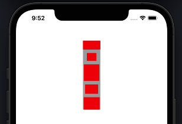

​	代码：原始代码

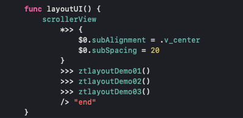

​			

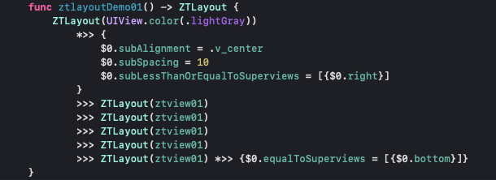

​	简化1：可以省略 `ZTLayout` 对象的创建

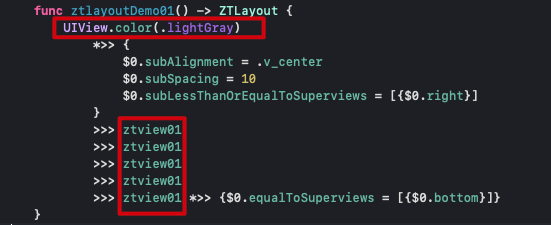

​	简化2：使用操作符 `>>/`

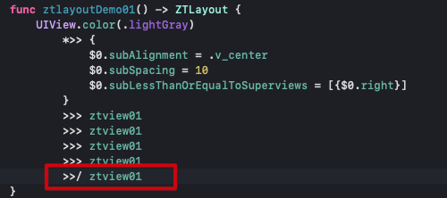

​	简化3：闭包循环创建

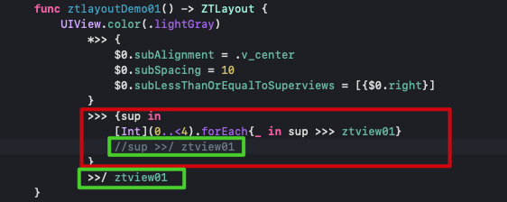

​	简化4：`*>>` 操作符可以直接传入 `ZTLayoutConfig` 对象

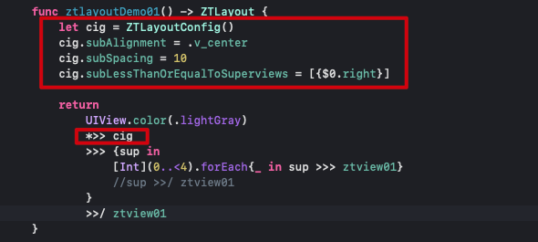

2. 多层嵌套示例

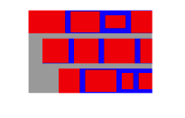

​	原始代码：

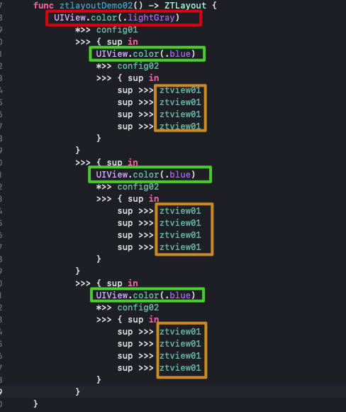

​	简化：使用操作符

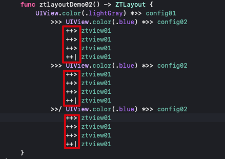

3. 多组 view 快速创建

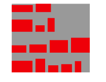

代码：

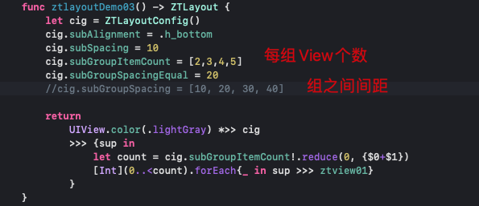

